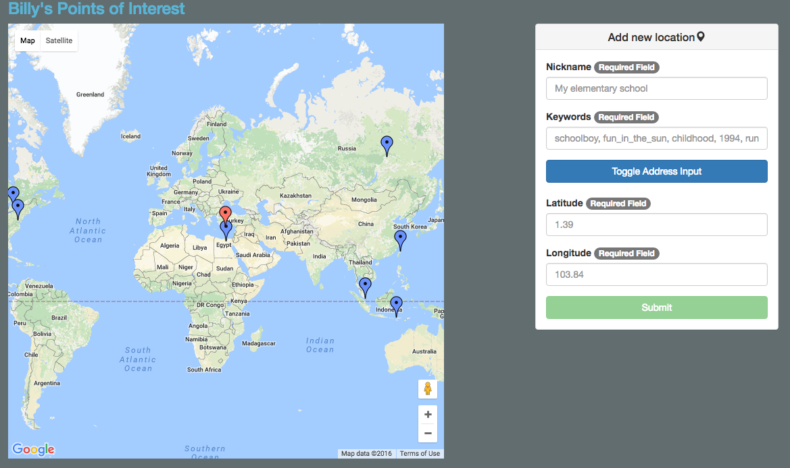
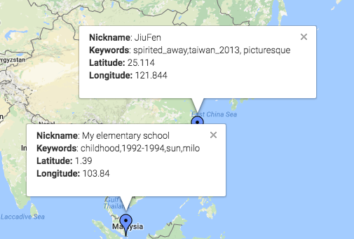

# Personal POI



# Overview
Using Google Maps API, drop pins on locations of personal interest.
Details about each pin are stored in MongoDB.

## Why?
I enjoy traveling and simply wanted a way for me to track my adventures.  In lieu of having an actual world map, I created this implementation as a way to virtually drop pins on locations that are meaningful to me.

## Future features to be implemented
1.  Move MongoDB online to support multiple users
2.  Related to 1, implement user registration and login to see personal pins
3.  Filter pins based on tag query

## To run your own version
1.  ```npm install```
2.  ```bower install```
3.  Start up your MongoDB
4.  ```node server.js```
5.  Go to ```localhost:3000``` for the app, access ```/points``` for a JSON object of your pins
